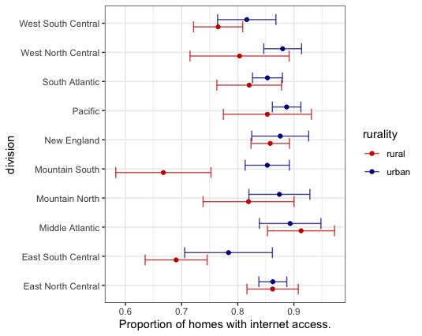
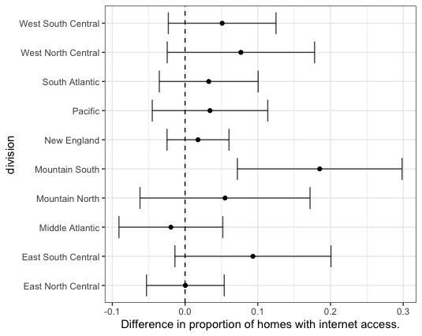

## About week4

The direct link to this page is:
https://github.com/jbender/Stats506_F20/tree/master/activities/week5/

### Part 1 (ggplot2)

Let's start by completing part 2 of the week 4 activity. 

In this part of the activity, we used the summary data includned in this 
repo to reproduce the plot in each question using ggplot. The data represents
summary results from an analysis of the 2015 RECS data comparing the proportion
of homes with internet access by Urban (including Urban Cluster) and Rural
status within each Census Division. 

1. Here is the plot for q1.

2. Here is the target plot for q2. 

